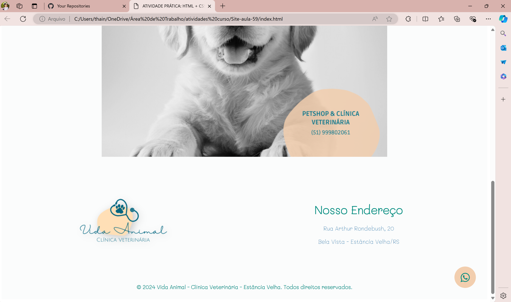

<h1>Site com: increase, decrease, troca de imagem para preto e branco com JavaScript.</h1>

## 1 páginas html:
- index.html
- contato.html

## 1 pasta css:
- style.css

## 1 pasta JS:
- script.js
- topnav.js

## 1 pasta fonte:
- Mali

 

 <h2>Index</h2>
 
 
 
  

<h2>Contato</h2>
 
 
  
